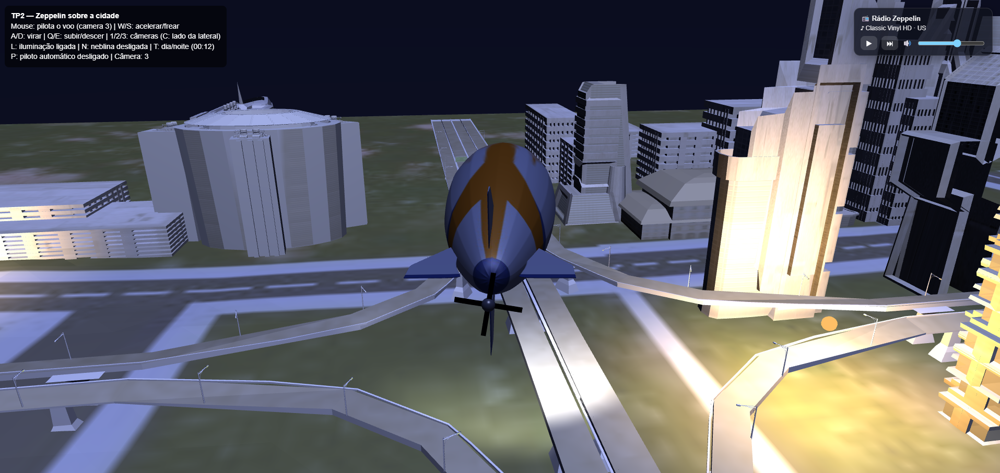
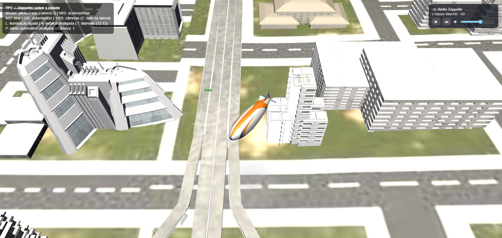
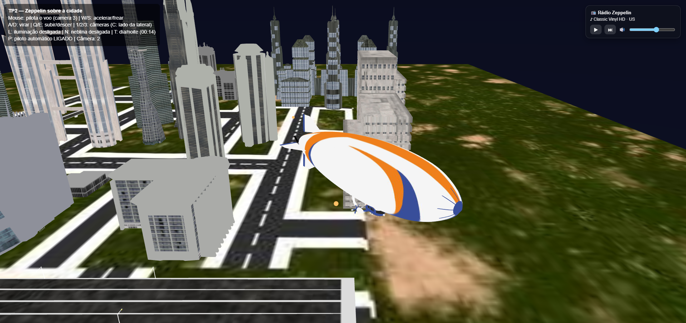

# TP2 — Zeppelin sobre a cidade

## Descrição

Simulador 3D em **WebGL2** no qual um zeppelin sobrevoa uma cidade. O jogador
pilota a aeronave (teclado e mouse) por um cenário carregado de um modelo `.obj`
texturizado, com iluminação dinâmica, ciclo de dia e noite e colisão com os
prédios. Há ainda um piloto automático que faz um tour pela cidade e uma rádio
de internet tocando ao fundo.

Construído com **twgl.js** (WebGL2).

## Autores

- Gabriel Pontes Camargo da Silva
- Samuel Bernardes

## Como executar

```bash
npm install
npm run dev      # servidor de desenvolvimento (Vite)
npm run build    # build de produção
```

## Controles

| Tecla / Mouse | Ação |
|---|---|
| `W` / `S` | Acelerar / frear |
| `A` / `D` | Virar à esquerda / direita |
| `Q` / `E` (ou `Shift` / `Espaço`) | Descer / subir |
| Mouse | Pilota o voo (na câmera 3) |
| `1` / `2` / `3` | Alternar câmeras (`C` troca o lado na câmera 2) |
| `L` | Liga/desliga a iluminação |
| `N` | Liga/desliga a neblina |
| `T` | Salta entre dia e noite |
| `P` | Liga/desliga o piloto automático |
| `R` / `.` / `-` `=` | Rádio: liga-pausa / próxima estação / volume |

## Itens adicionais implementados

Além dos requisitos básicos (carga de modelo `.obj`, objeto com componente de
rotação contínua, múltiplas câmeras e iluminação), foram implementados:

- **Modelo `.obj` multi-material texturizado** — cidade ("wild town") e o próprio
  zeppelin carregados de arquivos `.obj` com seus `.mtl` e texturas (parser
  próprio de OBJ/MTL em `src/loaders/`).
- **Iluminação de Phong por fragmento** — componentes ambiente, difusa (Lambert)
  e especular (Blinn-Phong), com correção de normais por *inverse-transpose*.
- **Ciclo de dia e noite** — `timeOfDay` contínuo que interpola cores de céu e
  luz por *keyframes*, com sol e lua se movendo pelo céu (tecla `T` salta entre
  dia e noite).
- **Luzes pontuais e spotlight** — postes espalhados pela cidade (acendem à
  noite, com atenuação por distância) e um farol em cone preso ao zeppelin.
- **Skybox com gradiente de céu** — cubo "no infinito" cujo gradiente
  horizonte→zênite varia com o horário.
- **Neblina (fog)** — mistura da cor do fragmento com a cor do horizonte conforme
  a distância (tecla `N`).
- **Colisão com os prédios** — *height field* construído por rasterização dos
  triângulos do cenário; o zeppelin trava e desliza de raspão contra as paredes,
  apoia-se nos telhados e respeita os limites do mundo. (Um pouco impreciso devido ao modelo .obj importado)
- **Sombra do zeppelin (blob shadow)** — disco translúcido assentado na
  superfície, que cresce e desbota conforme a altura de voo.
- **Hélice articulada** — componente de rotação contínua, montado por
  transformações hierárquicas independentes do corpo.
- **Banking e pitch** — o zeppelin inclina (roll) ao curvar e levanta/baixa o
  nariz ao subir/descer, com retorno suave.
- **Três modos de câmera** — vista superior em 3/4, quatro vistas laterais
  elevadas e câmera de perseguição (*chase cam*), todas com suavização (*lerp*).
- **Controle por mouse** — cursor longe do centro vira curva e subida/descida,
  com zona morta central.
- **Piloto automático** — tour autônomo em órbita elíptica derivada da cidade,
  produzindo os mesmos comandos de voo do jogador.
- **Rádio de internet** — streaming de estações de jazz (Radio Browser API), com
  painel HTML e controles por teclado.
- **HUD** — informações de estado (câmeras, iluminação, hora, piloto automático)
  desenhadas em HTML sobre o canvas.

## Estrutura do projeto

```
src/
  core/      contexto WebGL, laço de animação, câmera, input, shaders
  shaders/   Phong (.vert/.frag) e skybox (.vert/.frag)
  loaders/   parsers de OBJ, MTL e texturas
  scene/     orquestração por frame (create/update/draw, dia-noite, luzes, autopilot)
  objects/   World, Zeppelin, Propeller, Skybox, Sky, Shadow
  math/      transformações (matrizes)
  utils/     colisão (height field), helpers
  radio/     rádio de internet
```

## Capturas de tela 





